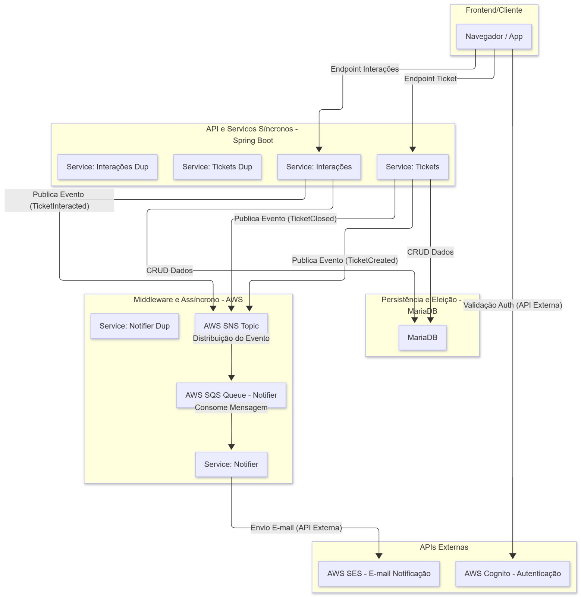

# TucasDesk

<p align="center">
  
</p>

TucasDesk é uma plataforma open-source de helpdesk que centraliza o atendimento e facilita o acompanhamento de chamados. Ideal para equipes que precisam organizar solicitações, priorizar demandas e manter o suporte sob controle.

## Visão Geral

TucasDesk oferece uma experiência completa para usuários, técnicos e administradores. Com ele é possível registrar, acompanhar e encerrar chamados em poucos cliques, garantindo transparência em todo o ciclo de suporte.

## Arquitetura do Sistema

A arquitetura do TucasDesk foi desenhada para ser escalável, desacoplada e resiliente, combinando serviços síncronos e assíncronos para otimizar a experiência do usuário e a eficiência operacional.

O diagrama abaixo detalha os principais componentes e o fluxo de comunicação entre eles:



### Componentes Principais

1.  **Frontend/Cliente (React + TypeScript)**:
    *   Interface web onde o usuário (cliente ou técnico) interage com o sistema.
    *   Responsável por consumir os endpoints da API para criar, visualizar e gerenciar chamados e interações.
    *   Realiza a validação de autenticação com a API, que delega a verificação para o AWS Cognito.

2.  **API e Serviços Síncronos (Spring Boot)**:
    *   **Endpoint-Tickets**: recebe requisições para criar (`TicketCreated`), fechar (`TicketClosed`) ou interagir (`TicketInteracted`) em um chamado.
    *   **Service-Tickets e Service-Interações**: contêm a lógica de negócio principal. Eles orquestram as operações de CRUD (criar, ler, atualizar, deletar) no banco de dados e publicam eventos para notificação.
    *   **Publica Evento**: ao criar, fechar ou adicionar uma interação a um chamado, a API publica eventos (ex: `TicketCreated`, `TicketClosed`) em um tópico do AWS SNS. Essa abordagem desacopla a API da lógica de notificação.

3.  **Middleware e Serviços Assíncronos (AWS)**:
    *   **AWS SNS (Simple Notification Service)**: atua como um tópico de distribuição de eventos. A API publica mensagens no SNS, que as encaminha para todas as filas SQS inscritas.
    *   **AWS SQS (Simple Queue Service)**: fila que recebe os eventos do SNS. O `Service: Notifier` consome mensagens desta fila para processá-las de forma assíncrona. Isso garante que, mesmo em caso de falha no serviço de notificação, a mensagem não será perdida.
    *   **Service: Notifier**: serviço que processa as mensagens da fila SQS. Ele é responsável por formatar e enviar e-mails utilizando o AWS SES.

4.  **Persistência (MariaDB)**:
    *   Banco de dados relacional onde todos os dados de chamados, usuários e interações são armazenados. As operações de CRUD são executadas pela API Spring Boot.

5.  **APIs Externas**:
    *   **AWS Cognito**: serviço de gerenciamento de identidade da AWS. A API o utiliza para validar os tokens de autenticação (`JWT`) enviados pelo frontend, garantindo que apenas usuários autenticados acessem os recursos.
    *   **AWS SES (Simple Email Service)**: serviço de envio de e-mails da AWS. O `Service: Notifier` o utiliza para enviar notificações por e-mail quando eventos importantes ocorrem (ex: confirmação de abertura de chamado).

### Fluxo de um Novo Chamado

1.  O usuário cria um novo chamado no **Frontend**.
2.  O **Frontend** envia uma requisição para o **Endpoint-Ticket** na API Spring Boot.
3.  O **Service-Tickets** processa a requisição, salva os dados no **MariaDB** (operação de CRUD) e publica um evento `TicketCreated` no tópico **AWS SNS**.
4.  O **AWS SNS** distribui o evento para a fila **AWS SQS**.
5.  O **Service: Notifier** consome a mensagem da fila SQS.
6.  O **Service: Notifier** utiliza o **AWS SES** para enviar um e-mail de notificação ao usuário.
7.  O **Frontend** recebe a resposta da API e atualiza a interface para o usuário.

Este design garante que a API principal permaneça rápida e responsiva, enquanto tarefas mais lentas, como o envio de e-mails, são executadas em segundo plano de forma confiável.


### Estrutura Essencial do Projeto

- `apps/backend/`: API em Spring Boot responsável pelas regras de negócio e integrações com o banco de dados.
- `apps/frontend/`: interface web em React + TypeScript com componentes reutilizáveis e navegação protegida.
- `infra/docker/`: arquivos do Docker Compose, incluindo `compose.yaml` e scripts de inicialização do banco.
- `config/env/`: variáveis de ambiente compartilhadas utilizadas durante a orquestração.

## Tecnologias Utilizadas

- **Java 21 + Spring Boot 3:** linguagem e framework escolhidos para entregar uma API robusta, segura e fácil de manter.
- **Spring Data JPA:** abstrai o acesso ao banco de dados, agilizando consultas e persistência de entidades.
- **Spring Security + AWS Cognito:** integra autenticação gerenciada com suporte a MFA, recuperação de senha e rotação de tokens.
- **MariaDB:** banco relacional principal para armazenar chamados, usuários e configurações com alto desempenho e confiabilidade.
- **React 19 + TypeScript:** interface moderna, tipada e reativa que melhora a experiência do usuário e a produtividade do time.
- **Vite:** ferramenta de build e dev server que acelera o desenvolvimento frontend.
- **Axios:** cliente HTTP que simplifica a comunicação entre frontend e backend.
- **Docker & Docker Compose:** padronizam o ambiente, possibilitando subir toda a stack com um único comando.

## Guia de Demonstração com LocalStack

Este guia oferece um passo a passo completo para configurar e executar o TucasDesk em um ambiente de desenvolvimento local utilizando Docker e LocalStack. Você poderá testar a autenticação de ponta a ponta, o sistema de notificações e a resiliência do sistema (failover).

### 1. Pré-requisitos

Antes de começar, garanta que você tenha as seguintes ferramentas instaladas e funcionando em sua máquina:

-   **Docker:** Uma plataforma para desenvolver, enviar e executar aplicativos em contêineres.
    -   [Guia de Instalação do Docker](https://docs.docker.com/get-docker/)
-   **Docker Compose:** Uma ferramenta para definir e executar aplicativos Docker de vários contêineres.
    -   [Guia de Instalação do Docker Compose](https://docs.docker.com/compose/install/)

### 2. Configuração do Ambiente

Com os pré-requisitos instalados, siga os passos abaixo para preparar o ambiente.

1.  **Clone o repositório:**
    ```sh
    git clone https://github.com/felipebehling/tucasdesk.git
    cd tucasdesk
    ```

2.  **Crie o arquivo de configuração `.env`:**
    Copie o arquivo de exemplo `.env.example` para criar seu próprio arquivo de configuração local. Os valores padrão já estão configurados para o ambiente LocalStack.
    ```sh
    cp .env.example .env
    ```

### 3. Executando a Aplicação

Agora, vamos iniciar todos os serviços da aplicação, incluindo o banco de dados, o LocalStack (simulando a AWS), os dois serviços de backend e o frontend.

1.  **Inicie os contêineres:**
    Execute o comando abaixo a partir da raiz do projeto. Ele irá construir as imagens e iniciar todos os serviços.
    ```sh
    docker compose up --build
    ```
    Aguarde até que todos os serviços estejam em execução. Você verá os logs de cada contêiner no seu terminal.

2.  **Acesse a aplicação:**
    Após a inicialização, a aplicação estará disponível nos seguintes endereços:
    -   **Frontend:** [http://localhost:3000](http://localhost:3000)
    -   **Backend 1:** [http://localhost:8081](http://localhost:8081)
    -   **Backend 2:** [http://localhost:8082](http://localhost:8082)

### 4. Cenários de Demonstração

Com a aplicação em execução, você pode testar os seguintes cenários.

#### Cenário 1: Autenticação com Cognito

Vamos simular o processo de registro e login de um novo usuário.

1.  **Crie uma conta:**
    -   Acesse a página de registro: [http://localhost:3000/register](http://localhost:3000/register).
    -   Preencha o formulário com um nome, e-mail e senha válidos.
    -   Clique em "Registrar". O LocalStack irá interceptar a chamada ao Cognito e criar o usuário.

2.  **Faça login:**
    -   Acesse a página de login: [http://localhost:3000/login](http://localhost:3000/login).
    -   Use as credenciais que você acabou de criar para fazer login.
    -   Após o login bem-sucedido, você será redirecionado para o dashboard principal.

#### Cenário 2: Notificações com SNS, SQS e SES

Vamos testar o fluxo de notificações assíncronas ao criar um novo chamado.

1.  **Crie um novo chamado:**
    -   No dashboard, clique no menu "Chamados" e depois em "Novo Chamado".
    -   Preencha o título e a descrição do chamado e clique em "Salvar".

2.  **Verifique a notificação (via logs do LocalStack):**
    -   No seu terminal, procure pelos logs do contêiner `tucasdesk-localstack`. Você deverá ver mensagens indicando que:
        1.  Uma mensagem foi publicada em um tópico **SNS** (`tucasdesk-local-ticket-created`).
        2.  A mensagem foi enviada para uma fila **SQS** (`tucasdesk-local-queue`).
        3.  Um e-mail foi "enviado" pelo **SES** (o LocalStack simula o envio e exibe os detalhes no log).

    Isso demonstra que o sistema de notificações está funcionando corretamente, de forma desacoplada da criação do chamado.

#### Cenário 3: Resiliência e Failover do Backend

Este cenário demonstra a alta disponibilidade do sistema. O TucasDesk utiliza um mecanismo de eleição de líder, onde apenas uma instância do backend (o "líder") é responsável por processar as notificações da fila SQS. Se o líder falhar, outra instância assume automaticamente.

1.  **Identifique o líder:**
    -   Nos logs do Docker Compose, procure por uma mensagem como a seguinte em um dos serviços de backend (`tucasdesk-backend-1` ou `tucasdesk-backend-2`):
      ```
      [INFO] ... LeaderElectionService : I am the new leader! (instanceId=1)
      ```
    -   Anote o `instanceId` do líder (1 ou 2).

2.  **Simule uma falha:**
    -   Pare o contêiner do backend que é o líder. Por exemplo, se o líder for o `backend-1`, execute em um novo terminal:
      ```sh
      docker compose stop tucasdesk-backend-1
      ```

3.  **Observe a eleição de um novo líder:**
    -   Volte para os logs do Docker Compose. Você verá que o outro serviço de backend detectou a falha e iniciou uma nova eleição.
    -   Em alguns segundos, você verá uma mensagem no outro backend (por exemplo, `tucasdesk-backend-2`) indicando que ele se tornou o novo líder:
      ```
      [INFO] ... LeaderElectionService : I am the new leader! (instanceId=2)
      ```
    -   A aplicação continuará funcionando normalmente, com o novo líder assumindo a responsabilidade de processar as notificações.

### 5. Encerrando a Aplicação

Quando terminar de usar a aplicação, você pode parar e remover todos os contêineres com um único comando.

```sh
docker compose down
```

Este comando irá parar os serviços, remover os contêineres e a rede, mas preservará o volume do banco de dados para que seus dados não sejam perdidos.

## Como contribuir

1. Faça um fork do repositório.
2. Crie uma branch com a sua feature ou correção.
3. Envie um pull request descrevendo as mudanças.

## Licença

Este projeto é distribuído sob a licença MIT. Consulte o arquivo `LICENSE` para mais detalhes.

